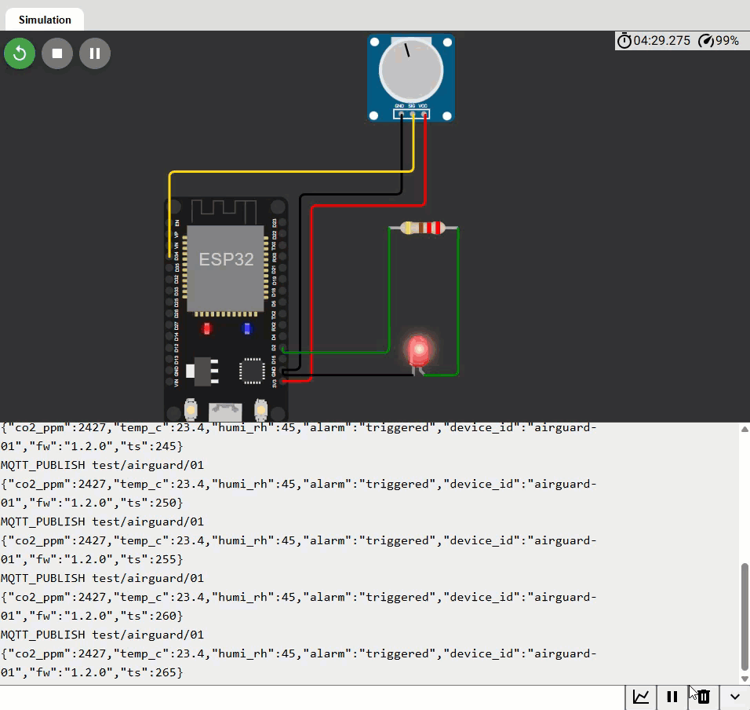

# Wokwi-модель ключового тестового сценарію 

## Що моделюється

Ключовий критичний сценарій з PRD — **CS-1: «CO2 → тривога → MQTT-повідомлення»**,

| Елемент HIL-стенда | Елемент Wokwi-моделі |
|---|---|
| DAC-ін'єкція HIL-агента (`hil.set_dac(mV)`) — signal injection у вхід MQ-135 | **Потенціометр** на GPIO34 (0–3.3 В) |
| ADC + мапінг «напруга → ppm» (FR-001) | `analogRead()` + лінійний мапінг 0..4095 → 400..5000 ppm |
| Тривога: RGB LED  при CO2 > порогу (FR-007-8) | **Червоний LED** на GPIO2 |
| UART CLI DUT: boot-банер, `status`, `config set`, `version` (FR-003/FR-004) | **Serial Monitor** 115200 |

## Посилання на онлайн-модель

**Посилання:** https://wokwi.com/projects/474855153224583169

**Скріншот(гіфта для кращої наглядності)**

На гіфці вище показано:
 - робота команди `status`, що виводить всі показники та статус альарма(тріггеред чи ні)
 - робота команди `config set alarm_threshold_ppm 800`, що ставить поріг забруднення на 800
 - Зміна положення потенціометра: при положенні > 800 діод загоряється і alarm triggered у логах, а при 700 і нижче, гасне і alarm знов у idle
 - робота команди `version`